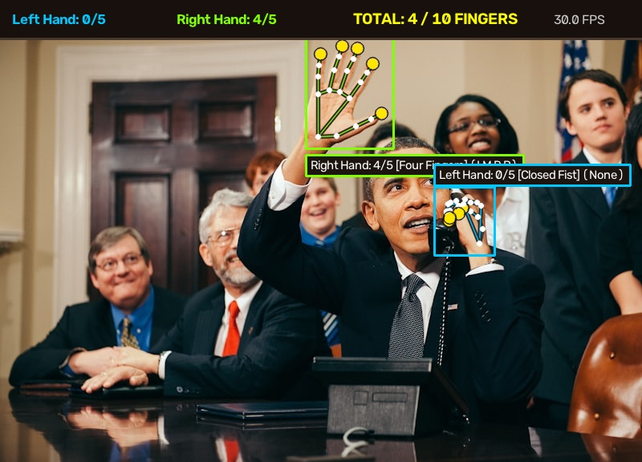

# DualHand-Vision

[](LICENSE)
[](https://www.python.org/)
[](https://opencv.org/)
[](https://developers.google.com/mediapipe)

Real-time computer vision system that tracks both hands simultaneously, isolates 21 three-dimensional skeletal joints per hand, counts extended fingers across a 0 to 10 range, and classifies static hand gestures.



---

## Technical Overview

Most computer vision tutorials for finger counting evaluate whether a fingertip Y-coordinate is above an intermediate joint. That check fails as soon as a hand is tilted, pointed sideways, or held at an angle.

DualHand-Vision resolves this limitation by calculating rotation-invariant Euclidean distance ratios from anatomical anchor points (the wrist origin and pinky metacarpophalangeal base). This provides consistent tracking at 30+ frames per second regardless of hand roll, pitch, or orientation.

### Key Capabilities

1. Simultaneous Dual-Hand Tracking: Identifies Left and Right hands independently and outputs individual (0 to 5) and combined (0 to 10) finger counts.
2. Rotation-Invariant Counting: Uses Euclidean distances from the wrist joint (landmark 0) to determine finger extension.
3. Radial Thumb Geometry: Measures radial thumb abduction relative to the pinky MCP joint (landmark 17) to cleanly differentiate an open thumb from a closed fist.
4. Mirror Mode Correction: Compensates for selfie-webcam mirroring so the user's physical right hand corresponds to the Right Hand label.
5. Gesture Classification: Recognizes gestures including Closed Fist, Pointing, Peace / Victory, Three Fingers, Four Fingers, Open Palm, Thumbs Up, OK Sign, and Rock / Horns.
6. Dual Interface: Direct OpenCV desktop window (for maximum 30+ FPS throughput) and an interactive Streamlit web dashboard.

---

## Repository Structure

```
DualHand-Vision/
|-- app.py               # Streamlit web dashboard
|-- live_cam.py          # Real-time 30+ FPS camera runner
|-- hand_detector.py     # Core detection and geometric counting engine
|-- visualizer.py        # 21-joint wireframe and HUD rendering
|-- test_counter.py      # Automated verification test script
|-- run.bat              # Windows batch menu launcher
|-- pyproject.toml       # Python package configuration
|-- requirements.txt     # Dependency list
|-- LICENSE              # MIT License
|-- models/
|   `-- hand_landmarker.task   # MediaPipe 21-point task model
`-- data/
    |-- sample.jpg             # Input test sample
    `-- annotated_sample.jpg   # Benchmark output visualization
```

---

## Finger Detection Formulation

### Fingers 1 Through 4 (Index, Middle, Ring, Pinky)

For each finger with tip joint T, proximal interphalangeal joint P, metacarpophalangeal joint M, and wrist origin W:

$$\text{Distance}(T, W) > \text{Distance}(P, W) \quad \text{and} \quad \text{Distance}(T, W) > \text{Distance}(M, W)$$

Because Euclidean distance from the wrist joint is invariant under 2D planar rotation, this condition holds regardless of whether the hand is vertical, tilted, or pointing horizontally.

### Thumb Abduction

Because the thumb articulates radially rather than along the vertical finger plane, extension is calculated relative to the pinky MCP joint K (landmark 17):

$$\text{Distance}(\text{ThumbTip}, K) > 1.10 \times \text{Distance}(\text{ThumbIP}, K)$$

When the thumb is curled into a closed fist, its distance to joint K decreases sharply, providing clean binary separation.

---

## Installation

### Prerequisites

* Python 3.10, 3.11, or 3.12
* A functional USB or integrated webcam

### Setup

1. Clone or open the repository:
```bash
git clone https://github.com/Shaayan-shah/DualHand-Vision.git
cd DualHand-Vision
```

2. Install dependencies:
```bash
pip install -r requirements.txt
```

---

## Running the Application

### Option 1: Interactive Menu (Windows)

Double-click `run.bat` or run:
```cmd
run.bat
```

### Option 2: High-Speed Live Desktop Camera (30+ FPS)

```bash
python live_cam.py
```
* Press `q` to close the camera window.
* Press `p` to capture and save a high-resolution snapshot to disk.

### Option 3: Interactive Web Dashboard (Streamlit)

```bash
streamlit run app.py
```

### Option 4: Automated Verification Suite

```bash
python test_counter.py
```

---

## Verification Results

The automated test suite verifies both-hand detection, 0 to 10 count range validity, and landmark rendering:

```text
Testing Dual-Hand Tracking and Finger Counting...
Detected 2 hand(s):
  - Right Hand: 4 fingers extended [Four Fingers]
  - Left Hand: 0 fingers extended [Closed Fist]
Total combined count: 4 (valid range 0-10)
Test passed successfully: Both hands tracked and fingers counted.
```

---

## License

This project is licensed under the terms of the [MIT License](LICENSE).
